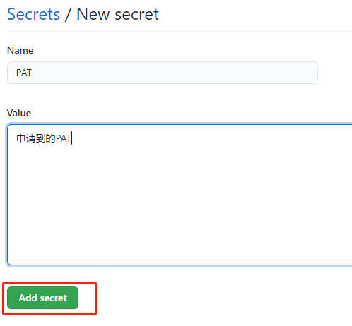

# 通过reposync方式进行代码同步

### 导入我的仓库

[点击导入仓库](https://github.com/new/import)

`URL框`填写`https://github.com/inoyna12/jd28`

`Repository Name`填写仓库名字(随意设置)，点击`Begin import`，等待导入完成(不要把仓库设为私有，会运行失败)。

### 申请PAT

点击 GitHub [用户设置页面](https://github.com/settings) 最下方的`Developer setting` ，然后选择 [`Personal access tokens`(点击快捷到达指定页面)](https://github.com/settings/tokens/new) 来生成一个 token，把 `repo`和`workflow` 两部分勾上即可。

点击最下面的创建按钮后，图示部分即为你的PAT(图示的已经删除了,仅为演示)，复制下来马上就要使用了

### 填写PAT到Secrets

申请完毕后，在分支中点击`Settings`-`Secrets`-`New secret`

`name`填`PAT`，`Value`填入上方申请到的PAT,保存即可

cookie填写跟上面一样

`Settings`-`Secrets`里面添加`JD_COOKIE`,`Value`填写你获取的cookie

多条 cookie 用`&`或者换行隔开，支持无数条 cookie

注意:由于Action的单次最大运行时长为6H，某些脚本运行时间过长，建议一个仓库添加最多5个`cookie`以保证每个账号都完全运行所有脚本，`cookie`比较多的用户可以多创建几个仓库

### 激活仓库

`PAT`和`COOKIE`填写好之后点击仓库右上角的`Star`激活你的仓库,激活成功后Action会运行所有脚本，到这里就可以不用管了，仓库会自动同步我的库并且按时运行脚本

